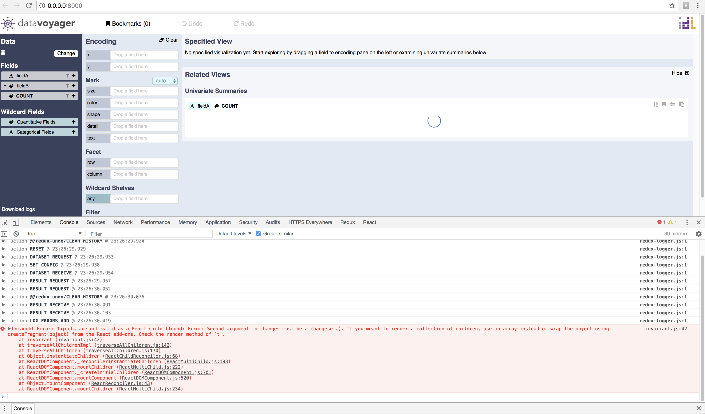

# Voyager example failure

Minimal example of [graphs not loading in voyager v2.0.0-alpha.15](https://github.com/vega/voyager/issues/767). It matches the [README example](https://github.com/vega/voyager#example-use) as closely as possible, modifying it only to get the imports working.

Screenshot:


To reproduce:

```bash
yarn
yarn build
python3 -m http.server 8000
open http://localhost:8000/
```
